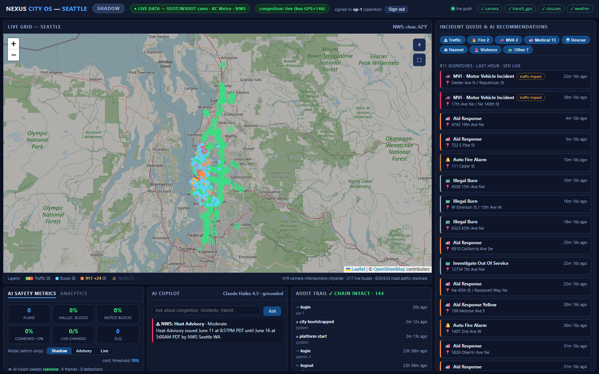
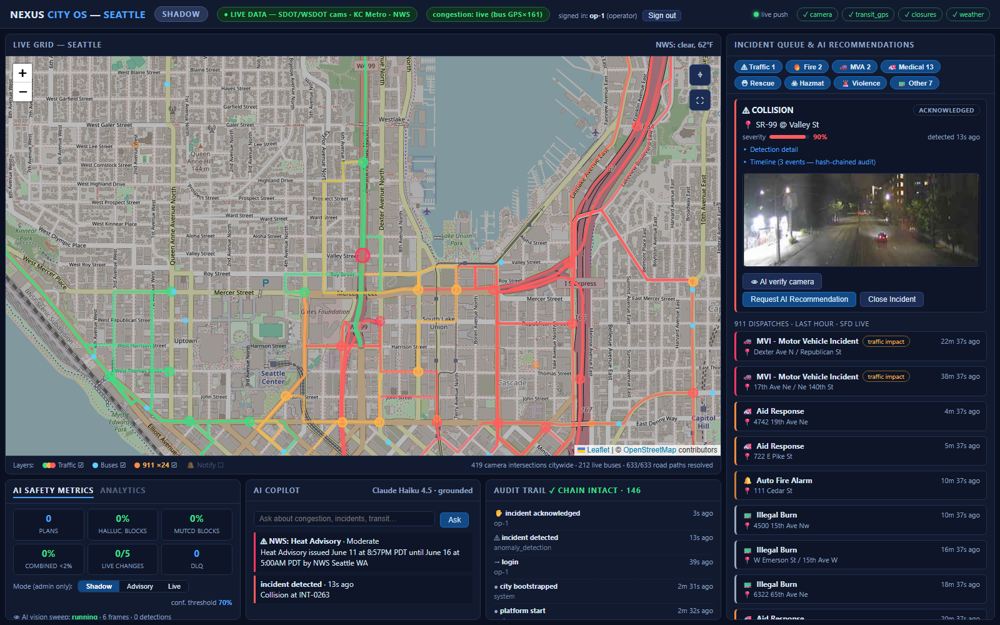
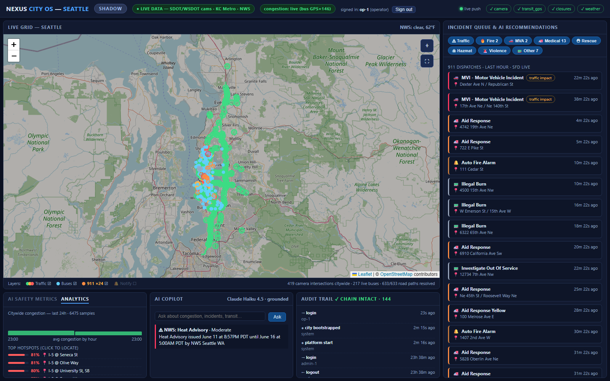

# Nexus City OS

**A decision-intelligence platform for real-time smart-city traffic management
and incident mitigation. Seattle-first. Extensible to any city on the planet.**

🌐 **Landing page:** https://adityaindoori.github.io/Nexus_City_OS/

Nexus City OS is a software-first layer that rides on a city's *existing*
cameras, transit feeds, and signal controllers. It fuses fragmented municipal
data into a living city graph, detects incidents with edge computer vision,
generates *provably constrained* AI mitigation recommendations, and routes
every action through a human-in-the-loop approval workflow with one-click
rollback and a tamper-evident audit trail.

> **Why this version wins** (see `MARKET_RESEARCH.md` for the full analysis):
> hardware-led adaptive signal control costs **~$116K per intersection**;
> smart-city platforms historically die over surveillance mistrust and
> unaccountable automation. Nexus is the opposite on every axis: no hardware,
> PII redacted at the edge, AI that can *prove* it cannot act outside its
> safety envelope, and a graduated Shadow → Advisory → Live rollout that lets
> any city pilot with zero risk.

## Screenshots (live platform)

**The Traffic Operations Center** — citywide live grid (419 real camera
intersections, congestion computed from real bus-GPS probes), SFD Real-Time
911 dispatch queue, AI safety metrics, grounded copilot, and the
tamper-evident audit trail:



**Incident workflow** — a collision at SR-99 @ Valley St: live traffic-camera
frame, severity, the audit-built timeline, and operator actions (AI verify
camera → request AI recommendation → approve/reject). Traffic flow lines
follow real road geometry:



**Historical analytics** — hourly citywide congestion, click-to-locate
hotspots, and incident/plan outcomes from the 7-day SQLite history:



---

## Quick Start (zero install dependencies — Python 3.10+ stdlib only)

```bash
# Run the full test suite (114 tests — the safety suite is the trust artifact)
python -m unittest discover -s platform/tests -t platform

# Launch the platform with REAL Seattle data (default)
python platform/run.py
# → Operator UI:  http://127.0.0.1:8757/   (sign in: op-1 / nexus-op-1)
# → demo accounts: op-1, admin-1, analyst-1, viewer-1 (password nexus-<user>)

# Other launch modes:
python platform/run.py --sim             # fully offline deterministic (no network)
python platform/run.py --city tacoma     # Tacoma / Pierce Transit (multi-city SDK)
python platform/run.py --port 9000       # custom port
python platform/run.py --host 0.0.0.0    # bind all interfaces (containers)
python platform/run.py --no-vision       # disable the background AI vision sweep
```

### Docker

```bash
docker compose up --build
# → http://localhost:8757/  (state persists in the nexus-data volume)

# Or directly:
docker build -t nexus-city-os .
docker run -p 8757:8757 nexus-city-os               # Seattle
docker run -p 8757:8757 nexus-city-os --city tacoma # Tacoma
```

CI (`.github/workflows/ci.yml`) runs the full test suite on Python 3.10 and
3.12 plus a Docker build on every push.

In the UI, **click any intersection** to see its **live SDOT traffic camera
image** and inject a collision scenario — then watch the full workflow:
detection → incident → AI recommendation (confidence + provenance + dry-run
simulation) → operator approval → mode-dependent execution → rollback.

## Real Data (default mode)

The platform runs against **real, live Seattle municipal data** out of the box
— no API keys required:

| Layer | Source | What you see |
|---|---|---|
| **Base map** | OpenStreetMap (Leaflet) | Actual Seattle streets, citywide — auto-fitted to the full camera network |
| **Intersections & cameras** | SDOT Travelers camera registry (`web.seattle.gov/Travelers` API) | The **entire registry**: ~420 real camera intersections / ~650 cameras (383 SDOT + 264 WSDOT) with true names and lat/lon — from "2nd Ave & Lenora St" downtown to "I-5 @ NE 195th St" |
| **Camera images** | seattle.gov / images.wsdot.wa.gov live JPEGs (proxied at `/api/camera?id=`) | The actual live street view at each intersection, refreshed ~every 30 s |
| **Transit vehicles** | OneBusAway Puget Sound (GTFS-RT-derived) | 300+ real King County Metro buses moving across the region in real time |
| **Weather** | National Weather Service (station KBFI) | Real current conditions feeding the AI's weather-aware confidence scoring |
| **911 emergencies** | Seattle Fire Dept Real-Time 911 (data.seattle.gov Socrata, Citizen-app style) | Live geocoded dispatches (fires, MVAs, medic responses, hazmat) as a toggleable map layer; traffic-impacting calls surface as alerts; optional **browser notifications** (🔔 legend toggle) for new traffic-impacting dispatches; the copilot chat is grounded in the feed |
| **Hazard alerts** | NWS active alerts (point query) | Severe-weather/hazard warnings pinned at the top of the alerts panel |
| **Congestion** | **Live bus GPS speed probes** (every moving bus is a sensor) + optional WSDOT loop-detector flow (`WSDOT_ACCESS_CODE` env var) | Per-intersection congestion is derived from REAL observed speeds (weighted median, freshness-windowed, highway-aware speed limits) — the header chip shows `congestion: live (bus GPS×N)` for the intersections under real estimation |
| **AI incident detection** | **Background AI vision sweep**: Claude Haiku analyzes live camera frames every ~2 min (congested intersections first) | Genuine detections enter the standard incident pipeline tagged `👁 AI-detected`; every automated detection is audit-logged; status at `/api/vision/status` |

Coverage is configurable: `SeattleLiveAdapter()` defaults to the full
registry; pass `SeattleLiveAdapter(bbox=DOWNTOWN_BBOX)` to scope a pilot to
the PRD's original downtown box (or any bounding box for a phased rollout).

**Graceful degradation:** every live client caches the last good payload; if a
feed is unreachable, the adapter falls back (ultimately to the deterministic
offline topology) and the staleness chips in the header surface the failure —
the platform never hides a degraded feed (PRD §8).

## Real Congestion + Real Computer Vision (Phases 1–2)

The last two simulated pieces are now real:

* **Congestion** (`nexus/congestion.py`): live bus GPS fixes are spatial
  speed probes. The `CongestionEstimator` buckets fixes to nearby
  intersections (grid index), requires ≥2 distinct vehicles inside a 180 s
  freshness window, takes the weighted **median** speed, and scores it
  against a 25 mph surface / 55 mph highway baseline (WSDOT cams use "@" in
  names). Optional WSDOT loop-detector flow joins as weight-3 samples when
  `WSDOT_ACCESS_CODE` is set. The engine **never** lets the edge simulator
  overwrite a fresh real estimate — but anomalous telemetry always drives
  congestion so injected scenarios work everywhere.
* **Incident detection** (`nexus/vision.py`): the `VisionSweep` daemon runs
  real Claude Haiku multimodal analysis on live camera frames (priority:
  congested intersections), publishing redacted telemetry with
  `source="ai_vision"` onto the same bus topic as the edge layer — so the
  privacy gate, dedupe, SafetyGate, and audit chain are reused unchanged.
  Detections require ≥70% model confidence; all failures degrade gracefully.

## Historical Analytics (Phase 3)

Congestion is sampled to SQLite once per minute (7-day retention,
auto-pruned). `GET /api/analytics?hours=24` aggregates hourly congestion
buckets, top hotspots, incident counts by type (incl. AI-vision detections),
and plan outcomes. The bottom-left UI panel is tabbed **AI Safety Metrics |
Analytics** — hour bars, click-to-locate hotspots, and outcome chips.

## Real AI Layer (Phase 3 — AIP mirror)

The platform now runs **production LLMs** through an OpenAI-compatible
gateway, one model per use-case:

| Use case | Model | What it does |
|---|---|---|
| **Plan generation** | Claude Sonnet 4.5 | Writes the mitigation operations + operator-facing rationale for each incident (deep traffic-engineering reasoning) |
| **Vision triage** | Claude Haiku 4.5 (multimodal) | "🤖 AI vision analysis" on any live SDOT/WSDOT camera frame: congestion level, incident visible, visibility, confidence — audit-logged |
| **Operator copilot** | Claude Haiku 4.5 | Natural-language chat grounded in the live city graph (congestion, incidents, transit, weather) |

**The LLM is never trusted** (PRD §4): planner output is schema-validated
(only candidate intersection IDs, deltas bounded 1–25 s, ≤3 operations —
hallucinated IDs are rejected), then passes the *independent* SafetyGate
(MUTCD verifier, hallucination monitor, provenance, confidence abstention)
before any operator sees it. On any model failure the deterministic expert
system answers instead — the mission thread never depends on model uptime.
Each plan is tagged with its generator (`llm (claude-sonnet-4.5)` vs
`deterministic (…)`) for full transparency.

## Production Hardening (Phase 1+2)

The platform now carries the first two production pillars, still with zero
external dependencies:

| Capability | Implementation |
|---|---|
| **Durable persistence** | SQLite (`nexus/store.py`, ANSI-portable to Postgres): the hash-chained audit trail is written through to disk and reloaded+verified on restart; operating mode and confidence threshold are restored exactly as the last Admin authorized them; incidents/plans are snapshotted (the plan-outcomes table feeds future confidence calibration) |
| **Authentication** | PBKDF2-HMAC-SHA256 credentials (210k iterations, per-user salt, constant-time compare), 5-strike lockout, HMAC-signed bearer session tokens (8h expiry, revocation on logout). Every `/api` route except login returns 401 without a valid token |
| **Identity integrity** | The acting principal is always the **verified token subject** — request bodies cannot impersonate users; an operator token attempting an Admin action gets 403 and an audit-logged `permission_denied` |
| **Security audit events** | `login`, `login_failed` (denied), `logout`, `permission_denied` all land in the tamper-evident chain |
| **Real-time push** | `/api/events` Server-Sent-Events stream driven by the engine's event hub — incidents, plans, mode changes, and grid ticks push to every signed-in console immediately (with a green "live push" indicator); polling is only a slow fallback |

Production swap points: `Store` → PostgreSQL/TimescaleDB, `Authenticator` →
OIDC/SAML SSO + MFA, SSE → WebSocket fan-out behind a gateway, signing key →
KMS/HSM.

## Repository Map

| Path | What it is |
|---|---|
| `PRD.md` | Original PRD (v1) |
| `PRD_REVIEW.md` | Formal review: 74 issues across 15 categories |
| `PRD_v2.md` | **Current requirements (v2.1)** — all review issues + consistency pass |
| `MASTER_PROMPT.md` | Engineering blueprint (v2), aligned with PRD v2.1 |
| `MARKET_RESEARCH.md` | Market sizing, competitive analysis, failure-mode research, strategy |
| `platform/` | **Reference implementation** |
| `platform/nexus/` | Platform core (see Architecture below) |
| `platform/ui/index.html` | Operator Live Grid UI (TOC console) |
| `platform/tests/` | 114 automated tests — safety guardrails, mode ladder, live-data fallback, persistence/auth, LLM validation, 911 feed, congestion estimation, vision sweep, analytics, multi-city, E2E |
| `platform/run.py` | Launcher (`--host/--port/--city/--sim/--no-vision`) |
| `platform/scripts/live_workflow_demo.py` | Scripted end-to-end mission thread |
| `Dockerfile` / `docker-compose.yml` | Container deployment (python:3.12-slim, no pip installs) |
| `.github/workflows/ci.yml` | CI: test matrix (3.10/3.12) + Docker build |

## Architecture

```
                       ┌─────────────────────────────────────────────┐
  City Adapter SDK     │              Nexus Platform Core            │
┌──────────────────┐   │  ┌──────────┐   ┌──────────────────────┐    │
│ SeattleAdapter   │──▶│  │ Telemetry│──▶│  Living City Graph   │    │
│  · GTFS-RT       │   │  │ Bus + DLQ│   │  (intersections,     │    │
│  · camera registry│  │  └──────────┘   │   segments, vehicles,│    │
│  · SDOT closures │   │       ▲         │   incidents, weather)│    │
│  · NWS weather   │   │  ┌────┴─────┐   └──────────┬───────────┘    │
│  · (ATMS bridge) │   │  │Edge layer│              ▼                │
└──────────────────┘   │  │ CV + PII │   ┌──────────────────────┐    │
  YourCityAdapter ──▶  │  │ redaction│   │ AI Copilot           │    │
  (one class = a city) │  └──────────┘   │  · ActionPlan w/     │    │
                       │                 │    provenance        │    │
                       │                 │  · confidence (PRD   │    │
                       │                 │    §4.3 weights)     │    │
                       │                 └──────────┬───────────┘    │
                       │                            ▼                │
                       │                 ┌──────────────────────┐    │
                       │   SAFETY GATE   │ 1 provenance check   │    │
                       │   (independent, │ 2 hallucination mon. │    │
                       │    runs before  │ 3 MUTCD verifier     │    │
                       │    any operator │   (R1–R7)            │    │
                       │    ever sees a  │ 4 confidence         │    │
                       │    plan)        │   abstention         │    │
                       │                 └──────────┬───────────┘    │
                       │                            ▼                │
                       │   HITL: operator reviews dry-run (CTM)      │
                       │   simulation → Approve / Reject             │
                       │                            ▼                │
                       │   MODE LADDER:  Shadow → Advisory → Live    │
                       │    shadow:   log only, never execute        │
                       │    advisory: formatted field instruction    │
                       │              (15-min expiry)                │
                       │    live:     execute + auto-revert monitor  │
                       │              + one-click rollback           │
                       │                            ▼                │
                       │   Hash-chained append-only AUDIT TRAIL      │
                       └─────────────────────────────────────────────┘
```

### Module guide (`platform/nexus/`)

| Module | Responsibility | PRD §§ |
|---|---|---|
| `models.py` | Typed domain model: entities, `ActionPlan`, confidence weights, freshness thresholds | 1, 4.2–4.3 |
| `graph.py` | Thread-safe living city graph; cascading dependency resolution (3-hop BFS, time-to-gridlock); extensible entity registry | 1.2, 2 |
| `bus.py` | Pub/sub telemetry bus with dead-letter queue (Kafka-swappable) | — |
| `edge.py` | Edge CV simulator: detection + **mandatory PII redaction**; scenario injection | 3, 11.6 |
| `copilot.py` | AI recommendation engine: LLM plan refinement (strictly validated) + deterministic fallback, vision triage, grounded chat, provenance, composite confidence, prompt-injection guard, rate limiting | 3, 4.1–4.3 |
| `llm.py` | OpenAI-compatible LLM client (stdlib): Sonnet 4.5 planner, Haiku 4.5 vision/chat, robust JSON extraction | 4.1 |
| `safety.py` | **The moat**: independent MUTCD Chapter 4D/4E constraint verifier (rules R1–R7), hallucination monitor (H1–H4), provenance suppression, confidence abstention with governed threshold (50–95%, Admin-only) | 4.2–4.5 |
| `simulation.py` | CTM-style mesoscopic dry-run impact simulation, weather-aware | 7.2 |
| `engine.py` | Orchestrator: mode ladder, incident lifecycle, HITL approval, rollback (manual + auto-revert monitoring), RBAC | 2, 5, 6, 7.1, 11.2 |
| `audit.py` | Hash-chained, append-only, tamper-evident audit trail; JSONL export for legal discovery | 11.3 |
| `adapters.py` | **City Adapter SDK**: `SeattleAdapter` (offline), parametrized `RegistryLiveAdapter` base, `SeattleLiveAdapter` + `TacomaAdapter` (real data) | 1.1 |
| `livedata.py` | Live clients (parametrized per city: OBA agency, NWS station, bbox, 911 URL): cameras + frames, transit, weather, 911, WSDOT flow — TTL-cached with stale fallback | 1.1, 8 |
| `congestion.py` | **Real congestion estimator**: bus-GPS speed probes + optional WSDOT flow → per-intersection congestion (weighted median, freshness window) | 1 |
| `vision.py` | **AI vision sweep**: background Claude Haiku analysis of live camera frames → real incident detections through the standard pipeline | 3 |
| `analytics.py` | Historical aggregation over the store: hourly congestion, hotspots, incident/plan outcomes | — |
| `store.py` | Durable SQLite persistence: audit chain, governance state, incidents/plans, users | 11.3 |
| `auth.py` | PBKDF2 credentials + HMAC-signed session tokens + lockout/revocation | 11.2 |
| `server.py` | Zero-dependency HTTP API + operator UI server + auth enforcement + SSE push + camera proxy | — |

## Safety Guarantees (each enforced by code and proven by tests)

1. **R1–R7 MUTCD guardrails** — minimum greens, pedestrian clearance, yellow
   intervals, cycle bounds, per-intersection + system-wide (≤5) concurrency
   limits, EMS-corridor green protection. Violating plans are **blocked**
   before any operator sees them.
2. **H1–H4 hallucination monitoring** — plans citing non-existent entities or
   stale data windows are blocked; block rates tracked separately
   (targets < 1% each, < 2% combined).
3. **Mandatory provenance** — plans without entities + timestamped sources +
   weather + rationale are auto-suppressed (never shown).
4. **Confidence abstention** — composite score (model 40% / freshness 25% /
   coverage 20% / historical 15%); below threshold → *"Insufficient data
   confidence… Manual assessment recommended."*
5. **Mode ladder** — *no code path* executes a physical change in Shadow or
   Advisory mode; verified by dedicated tests.
6. **HITL** — `requires_human_approval` is constant-true; approval re-runs the
   constraint verifier (defense in depth) and records the exact plan hash.
7. **Rollback** — one-click revert restores the exact prior timing; auto-revert
   proposal fires when congestion worsens ≥20% within 5 minutes.
8. **Tamper evidence** — modifying any audit entry breaks the hash chain
   (`verify_chain()`), surfaced live in the UI.
9. **Privacy** — unredacted telemetry is rejected at ingestion and routed to
   the DLQ; raw video never enters the platform.

## Adding a New City

The SDK is proven by `TacomaAdapter` — a real second city with **zero new
API keys** (Pierce Transit on the same OneBusAway instance, WSDOT cameras
from the same regional registry, NWS station KTIW):

```python
from nexus.adapters import RegistryLiveAdapter
from nexus.livedata import TACOMA_BBOX

class TacomaAdapter(RegistryLiveAdapter):     # ~15 lines in adapters.py
    city_id = "tacoma"
    display_name = "Tacoma, WA — Pierce Transit (LIVE data)"

    def __init__(self, bbox=None):
        super().__init__(bbox=bbox or TACOMA_BBOX,
                         oba_agency="3",          # Pierce Transit
                         nws_station="KTIW",      # Tacoma Narrows
                         socrata_911_url=None,    # no Tacoma feed → disabled
                         transit_label="Pierce Transit")
```

Launch with `python platform/run.py --city tacoma`; available cities are
listed at `GET /api/cities`. For a fully custom city, implement the
four-method `CityAdapter` contract:

```python
from nexus.adapters import CityAdapter

class PortlandAdapter(CityAdapter):
    city_id = "portland"
    display_name = "Portland, OR — Central City"

    def load_topology(self):  ...   # intersections, segments, cameras
    def poll_transit(self):   ...   # GTFS-RT (TriMet)
    def poll_weather(self):   ...   # NWS station KPDX
    def poll_closures(self):  ...   # PBOT open data
    def controller_bridge(self):    # optional, Live Mode only
        return None                 # start in Shadow/Advisory
```

```python
from nexus import bootstrap
engine, edge, adapter = bootstrap(PortlandAdapter())
```

## Testing

```
python -m unittest discover -s platform/tests -t platform
```

114 tests (network-independent): every MUTCD rule, every hallucination check,
911-feed parsing (category/traffic-impact mapping, geo/time filtering,
degradation),
LLM-output validation (hallucinated-ID and out-of-bound-delta rejection,
deterministic fallback, safety-gating of LLM plans, vision degradation),
real-congestion estimation (speed→congestion mapping, min-sample/freshness
windows, highway heuristic, engine guard vs. injected anomalies),
AI vision sweep (fake-LLM detection → `ai_vision` incidents, low-confidence
abstention, degradation without exception, congestion mapping, camera
prioritization),
analytics aggregation (hourly buckets, hotspot ordering, plan-outcome
bucketing, pruning, empty-store safety),
multi-city SDK (TacomaAdapter identity/params, offline fallback, shared
topology builder regression, disabled-911 health),
audit-chain restart durability, governance-state restoration, credential
verification + lockout + token forgery/revocation rejection, salted hashing,
event-hub wakeups, live-adapter graceful fallback, provenance suppression,
confidence abstention + governed threshold, mode-ladder non-execution proofs,
exact-restore rollback, auto-revert monitoring, RBAC denial, audit chain
tamper-evidence, DLQ routing, privacy gate, prompt-injection + rate-limit
protection, cascading impact, simulation latency (<5 s PRD budget), adapter
topology, and the full end-to-end mission thread (collision at 4th & Pike →
resolution).

## Production Path

The reference implementation is deliberately zero-dependency so any city
stakeholder can run the full workflow offline. The interfaces are designed for
production swaps documented in `MASTER_PROMPT.md`:
`TelemetryBus` → Kafka, `CityGraph` → Neo4j, constraint verifier → OPA/Rego,
the deterministic copilot → an LLM behind the same `generate_plan()` contract
(the SafetyGate downstream is model-agnostic and never trusts the generator),
plus SSO/MFA, NIST 800-82 network segmentation, and the Appendix A
NTCIP/ATMS controller bridge per `PRD_v2.md`.